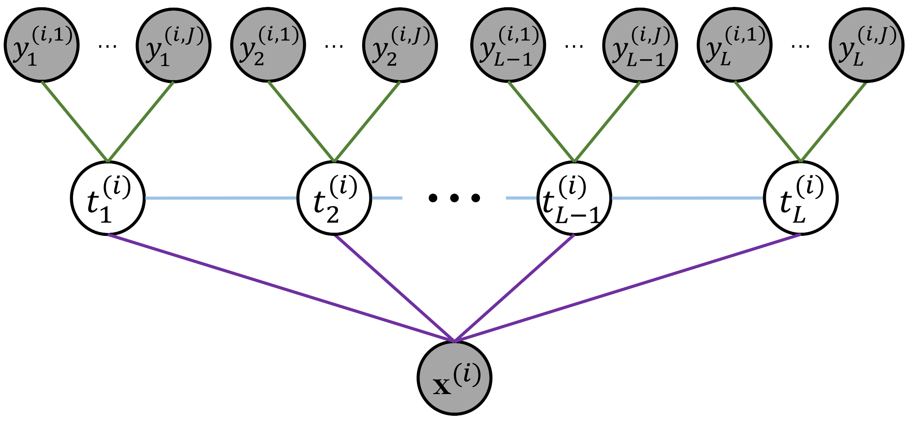

<br/>
<p align="center">
  <h1 align="center">Neural-Hidden-CRF: A Robust Weakly-Supervised Sequence Labeler (KDD-2023)</h1>


  <p align="center">
    <a href="https://scholar.google.com/citations?user=3slpkWAAAAAJ&hl=zh-CN">Zhijun Chen</a>,
    <a href="https://hsun2022.github.io/">Hailong Sun</a>,
    <a >Wanhao Zhang</a>,
    <a >Chunyi Xu</a>,
    <a href="https://scholar.google.com/citations?hl=zh-CN&user=PnDqlPkAAAAJ&view_op=list_works&sortby=pubdate">Qianren Mao</a>,
    <a href="https://scholar.google.com/citations?user=mzXg1s8AAAAJ&hl=zh-CN">Pengpeng Chen</a>
  </p>
  <p align="center">
    <a href='https://dl.acm.org/doi/pdf/10.1145/3580305.3599445'>
      
    </a>
    <a href='https://www.youtube.com/watch?v=e9Z8tqzdgJk&t=7s' style='padding-left: 0.5rem;'>
      
    </a>
    <a href='https://github.com/junchenzhi/Neural-Hidden-CRF/blob/master/tutorial/Neural-Hidden-CRF.pdf' style='padding-left: 0.5rem;'>
      
    </a>
    <a href='https://github.com/junchenzhi/Neural-Hidden-CRF/blob/master/tutorial/Neural-Hidden-CRF(Chinese).pdf' style='padding-left: 0.5rem;'>
      
    </a>
  </p>
  <p align="center">
    
  </p>

</p>


<br/>

## 1 Introduction
We propose a neuralized undirected graphical model called Neural-Hidden-CRF to solve the weakly-supervised sequence labeling problem. 
Under the umbrella of undirected graphical theory, the proposed Neural-Hidden-CRF embedded with a hidden CRF layer models the variables of word sequence, latent ground truth sequence, and weak label sequence with the global perspective that undirected graphical models particularly enjoy. 
In Neural-Hidden-CRF, we can capitalize on the powerful language model BERT or other deep models to provide rich contextual semantic knowledge to the latent ground truth sequence, and use the hidden CRF layer to capture the internal label dependencies. Neural-Hidden-CRF is conceptually simple and empirically powerful. 
It obtains new state-of-the-art results on one crowdsourcing benchmark and three weak-supervision benchmarks, including outperforming the recent advanced model CHMM by 2.80 F1 points and 2.23 F1 points in average generalization and inference performance, respectively.


## 2 Code
### 2.1 Environment
- `conda env create -f wrench_neural_hidden_crf.yaml`
### 2.2 Training/Evaluation
- `bash experiments_all_datasets.sh`

### 2.3 Others: Suggestions for Setting Hyperparameters
Note that: When applying our Neural-Hidden-CRF to other datasets, in most cases, we recommend considering the following suggestions for setting hyperparameters.
- For batch size:
Our suggested finding space is {8, 16, 32, 64, ...}, and batch size should not be set to $1$ (which would not be conducive to the challenging multi-source weak supervision learning context);
- For the learning rate of weak source transition matrix:
We suggest that the learning rate of weak source transition matrix be set equal to or less than the learning rate of the CRF layer;
- For $\rho$ (in Equation 21}):
Our suggested finding space is {2.0, 3.0, 4.0, 5.0, 6.0} for most cases;
- For the pre-train of the classifier part of the model:
We suggest using better superparameters (e.g., batch size, learning rates, etc.) for pre-train to get a better parameter initialization.


## 4 Some helpful materials 
- <p align="center">
  <p>
    <a href='https://dl.acm.org/doi/pdf/10.1145/3580305.3599445'>
      
    </a>
    <a href='https://www.youtube.com/watch?v=e9Z8tqzdgJk&t=7s' style='padding-left: 0.5rem;'>
      
    </a>
    <a href='https://github.com/junchenzhi/Neural-Hidden-CRF/blob/master/tutorial/Neural-Hidden-CRF.pdf' style='padding-left: 0.5rem;'>
      
    </a>
    <a href='https://github.com/junchenzhi/Neural-Hidden-CRF/blob/master/tutorial/Neural-Hidden-CRF(Chinese).pdf' style='padding-left: 0.5rem;'>
      
    </a>
  </p>

</p>


- An awesome tutorial about BiLSTM-CRF: https://pytorch.org/tutorials/beginner/nlp/advanced_tutorial.html  
(On intrinsic methodology, our method shares similarities with CRFs (e.g., BiLSMT-CRF).
We believe gaining familiarity with CRFs before delving into our method would be a good choice.)


## 5 Citation

If you find our work useful, please consider citing:

```
@inproceedings{chen2023neural,
  title={Neural-Hidden-CRF: A Robust Weakly-Supervised Sequence Labeler},
  author={Chen, Zhijun and Sun, Hailong and Zhang, Wanhao and Xu, Chunyi and Mao, Qianren and Chen, Pengpeng},
  booktitle={Proceedings of the 29th ACM SIGKDD Conference on Knowledge Discovery and Data Mining},
  pages={274--285},
  year={2023}
}
```


## Acknowledgement

Our code is largely based on Wrench (https://github.com/JieyuZ2/wrench).
Thanks for their contributions.

## Contributors

* Zhijun Chen
* Wanhao Zhang
* Chunyi Xu